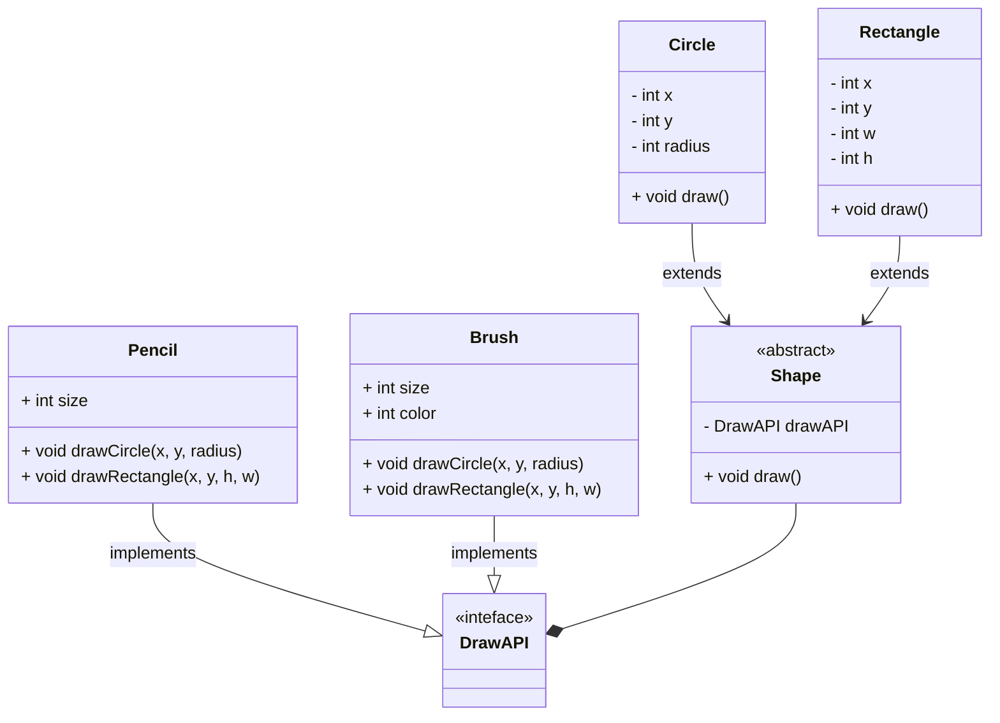

# Bridge Pattern

## Design


```mermaid
classDiagram
class Shape
<<abstract>> Shape
Shape: - DrawAPI drawAPI
Shape: + void draw()

Circle --> Shape: extends
Circle: - int x
Circle: - int y
Circle: - int radius
Circle: + void draw()

Rectangle --> Shape: extends
Rectangle: - int x
Rectangle: - int y
Rectangle: - int w
Rectangle: - int h
Rectangle: + void draw()


class DrawAPI
<<inteface>> DrawAPI

Pencil --|> DrawAPI: implements
Pencil: + int size
Pencil: + void drawCircle(x, y, radius)
Pencil: + void drawRectangle(x, y, h, w)

Brush --|> DrawAPI: implements
Brush: + int size
Brush: + int color
Brush: + void drawCircle(x, y, radius)
Brush: + void drawRectangle(x, y, h, w)

Shape --* DrawAPI
```

## Code

Run code

```shell
mvn compile && mvn exec:java -Pbridge
```
