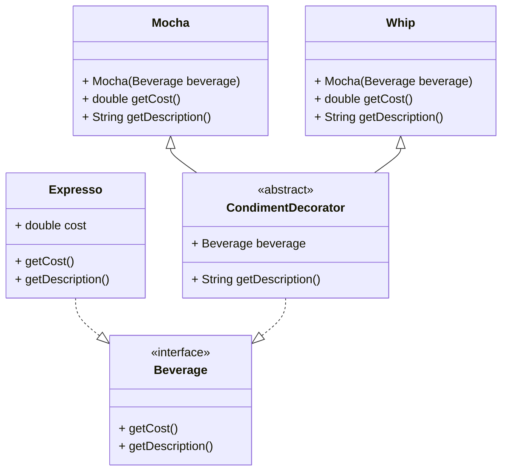

# Decorator Pattern

## Diagram


```mermaid
classDiagram
class Beverage
<<interface>> Beverage
Beverage: + getCost()
Beverage: + getDescription()

class Expresso
Expresso: + double cost
Expresso: + getCost()
Expresso: + getDescription()

Expresso ..|> Beverage

class CondimentDecorator
<<abstract>> CondimentDecorator
CondimentDecorator ..|> Beverage
CondimentDecorator: + Beverage beverage
CondimentDecorator: + String getDescription()

class Mocha
Mocha <|-- CondimentDecorator
Mocha: + Mocha(Beverage beverage)
Mocha: + double getCost()
Mocha: + String getDescription()

class Whip
Whip <|-- CondimentDecorator
Whip: + Mocha(Beverage beverage)
Whip: + double getCost()
Whip: + String getDescription()
```

## Run Code

```shell
mvn compile && mvn exec:java -Pdecorator
```
