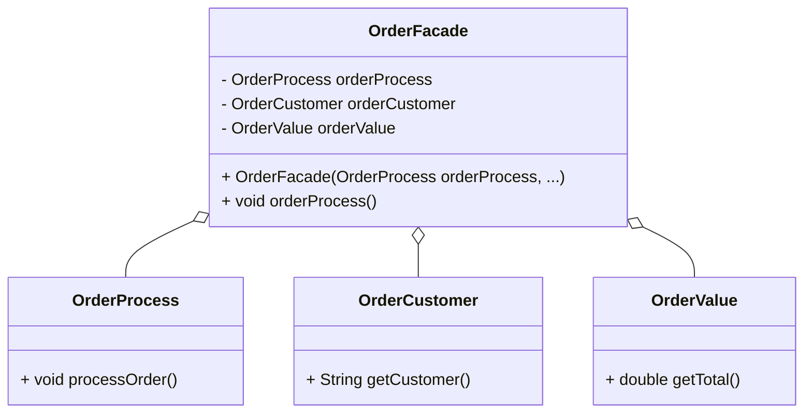

# Facade Pattern

## Class Diagram


```mermaid
classDiagram
class OrderProcess
OrderProcess: + void processOrder()

class OrderCustomer
OrderCustomer: + String getCustomer()

class OrderValue
OrderValue: + double getTotal()

class OrderFacade
OrderFacade: - OrderProcess orderProcess
OrderFacade: - OrderCustomer orderCustomer
OrderFacade: - OrderValue orderValue
OrderFacade: + OrderFacade(OrderProcess orderProcess, ...)
OrderFacade: + void orderProcess()

OrderFacade o-- OrderProcess
OrderFacade o-- OrderCustomer
OrderFacade o-- OrderValue
```

## Run Code

```shell
mvn compile && mvn exec:java -Pfacade
```
