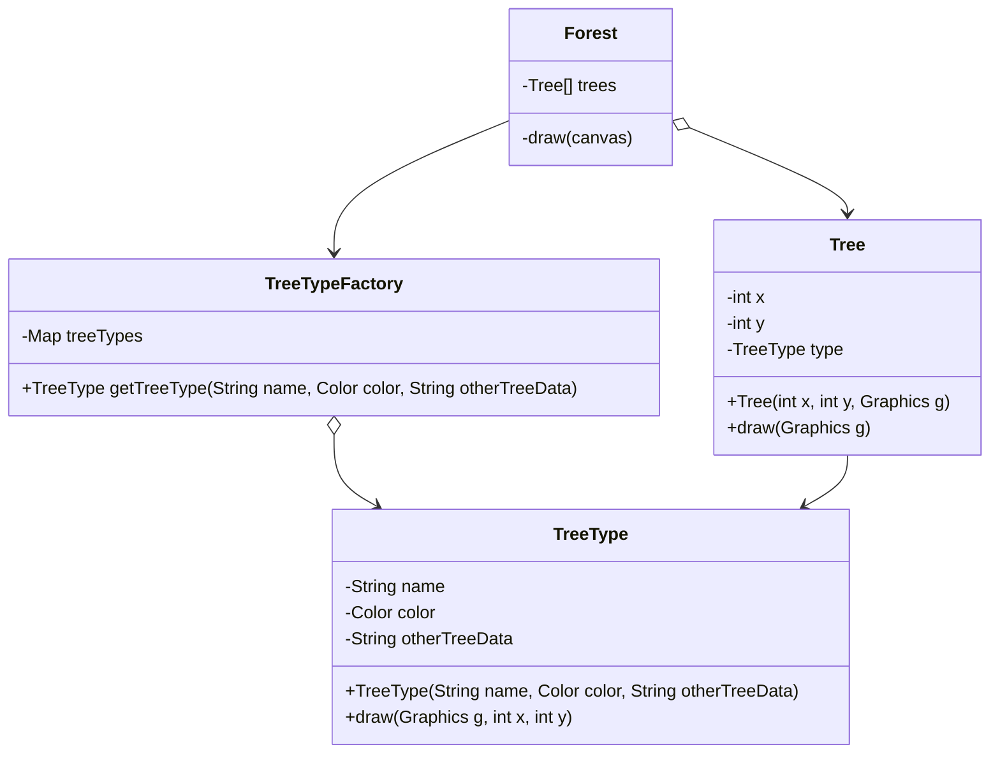

# Flyweight

```mermaid
classDiagram
    class Forest
    Forest:-Tree[] trees 
    Forest:-draw(canvas)

    class Tree
    Tree:-int x
    Tree:-int y
    Tree:-TreeType type
    Tree:+Tree(int x, int y, Graphics g)
    Tree:+draw(Graphics g)  

    class TreeType
    TreeType:-String name
    TreeType:-Color color
    TreeType:-String otherTreeData
    TreeType:+TreeType(String name, Color color, String otherTreeData)
    TreeType:+draw(Graphics g, int x, int y)

    class TreeTypeFactory
    TreeTypeFactory:-Map<String, TreeType> treeTypes
    TreeTypeFactory:+TreeType getTreeType(String name, Color color, String otherTreeData)

    TreeTypeFactory o--> TreeType
    Forest o--> Tree
    Forest --> TreeTypeFactory
    Tree --> TreeType
```
